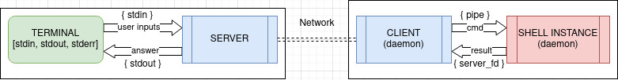
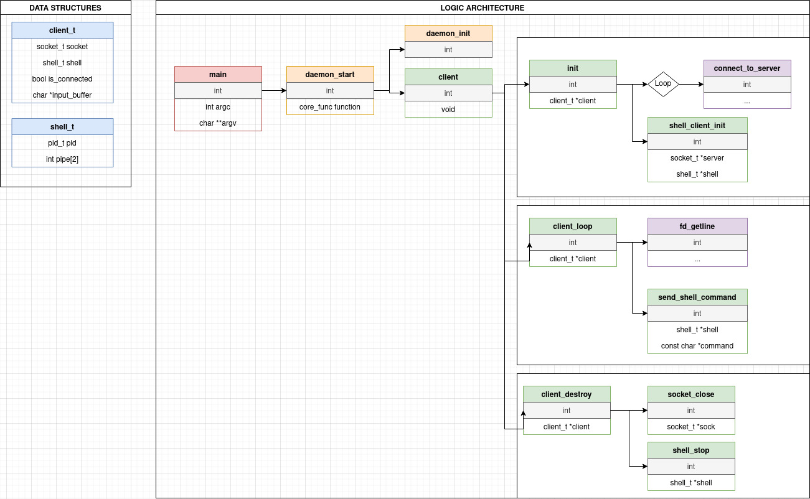
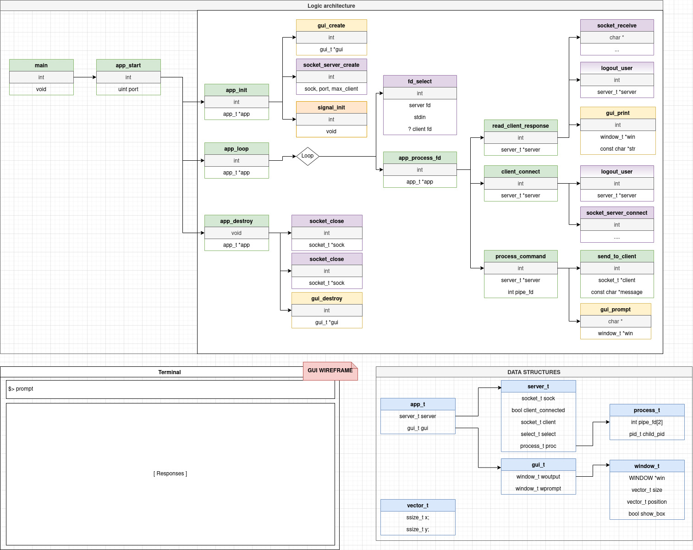

# Epitech Hub - Workshop - My_Troyan 04/2021

The goal of this project is to create a simple troyan application that allow to take discreetly the controle of a remote computer. 

## Usage
`$> cd server && make && ./my_troyan_cli`

`$> cd client && make && ./my_troyan`

Linux only

## Documentation

# Concept

# Client

# Server

